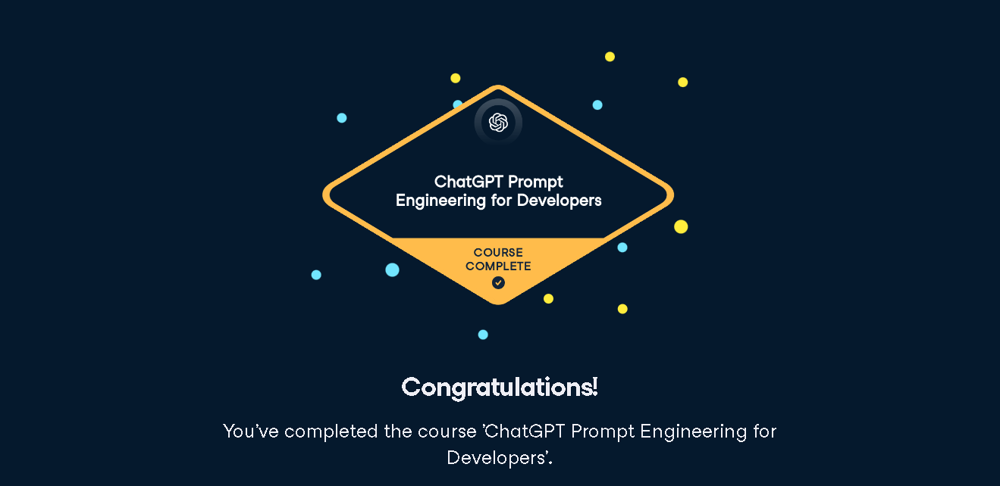

# ChatGPT Prompt Engineering for Developers - Course Solutions

This repository contains all the course work solutions for the **DATACAMP course "ChatGPT Prompt Engineering for Developers"** by **Fouad Trad**. The repository showcases my progress and mastery in crafting prompts, refining outputs, and integrating language models into various applications.

## Course Modules

### 1. **Introduction to Prompt Engineering Best Practices** 
   - **Description:** Master the art of crafting effective prompts, designing structured outputs, and implementing intelligent conditional prompts to revolutionize applications. Learn the core principles and best practices of prompt engineering to achieve unparalleled success in AI.

### 2. **Advanced Prompt Engineering Strategies**
   - **Description:** Discover advanced techniques in prompt engineering, focusing on designing more precise and effective prompts. Iteratively refine prompts through experimentation and analysis for more accurate and meaningful outputs.

### 3. **Prompt Engineering for Business Applications**
   - **Description:** Learn how to apply prompt engineering techniques in real-world business scenarios. Tailor language models to meet the dynamic needs of businesses, enabling innovation, informed decision-making, and streamlined operations with AI-powered solutions.

### 4. **Prompt Engineering for Chatbot Development**
   - **Description:** Explore effective prompt engineering for chatbot development, including system prompts and role-playing strategies. Learn to build chatbots that engage users with natural conversations and seamless context integration.

Feel free to explore the repository for solutions and insights from these cutting-edge courses!
